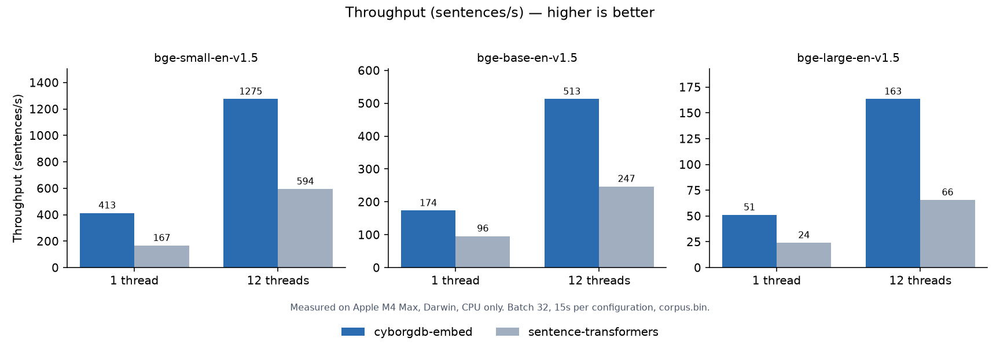
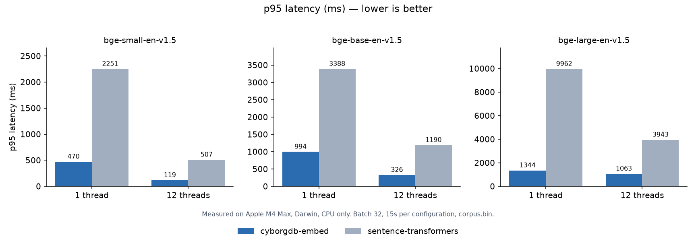
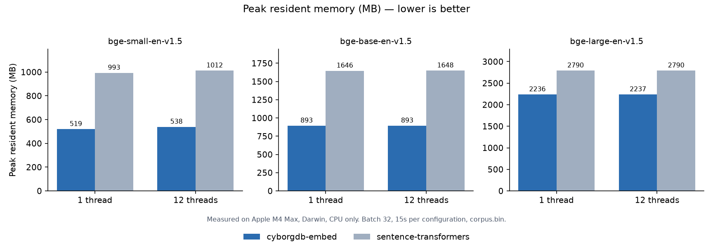

# cyborgdb-embed

Text embedding in C++, numerically equivalent to `sentence-transformers`.

`cyborgdb-embed` is a static C++ library built on ONNX Runtime, with no Python runtime or shared-library dependencies.

## Quick start

```cmake
include(FetchContent)

FetchContent_Declare(
  cyborgdb_embed
  GIT_REPOSITORY https://github.com/cyborg/cyborgdb-embed.git
  GIT_TAG v0.2.0
)

FetchContent_MakeAvailable(cyborgdb_embed)

target_link_libraries(your_target PRIVATE cyborgdb::embed)
```

Dependencies are linked statically. Linux builds require `libcurl` and OpenSSL development headers (`libcurl4-openssl-dev` and `libssl-dev` on Debian/Ubuntu).

```cpp
#include <cyborgdb_embed/embed.hpp>

namespace embed = cyborgdb::embed;

embed::Embedder model;

if (auto s = embed::open(
        embed::ModelId::BgeBaseEnV15,
        embed::Options{},
        model);
    !s) {
  return s;
}

std::vector<std::string_view> docs = {
    "first passage",
    "second passage",
};

std::vector<float> out(
    docs.size() * model.dimension());

model.embed_documents(
    docs.data(),
    docs.size(),
    out.data(),
    out.size());
```

Documents and queries use separate calls because some models require asymmetric prefixes such as `query:` and `passage:`.

`Embedder` is cheap to copy and thread-safe. Copies of the same model share one in-process session and one copy of the weights.

### Looking up a model by name

`find_model` accepts the names `sentence-transformers` accepts: the full upstream id (`sentence-transformers/all-MiniLM-L6-v2`) or a bare name (`all-MiniLM-L6-v2`), matched case-insensitively.

```cpp
embed::ModelId id;
if (auto s = embed::find_model(configured_name, id); !s) {
  return s;  // InvalidArgument, listing the supported models
}
```

Hosted API models such as `text-embedding-3-small` are rejected with a message saying so.

### Threads

Every model runs on one process-wide ONNX Runtime thread pool, so opening another model adds its weights but no threads. Size the pool once, before the first `open`:

```cpp
embed::configure_runtime(embed::RuntimeConfig{4});
```

The default is one thread per call; throughput is expected to come from concurrent callers. The pool lives for the rest of the process, so after the first `open` only the value already in force is accepted and any other returns `InvalidArgument`. An application with a per-client thread setting should call `configure_runtime` once at startup and treat `InvalidArgument` as two clients asking for different sizes.

## Supported models

All supported models are verified against `sentence-transformers` on a frozen corpus; the verdict is generated by that run, never written by hand.

| Model                                                         |  Dim | Max tokens | Pooling | Prefixes | Normalized | Parity                 |
| ------------------------------------------------------------- | ---: | ---------: | ------- | -------- | ---------- | ---------------------- |
| `sentence-transformers/all-MiniLM-L6-v2`                      |  384 |        256 | mean    | —        | yes        | numerically-equivalent |
| `sentence-transformers/all-MiniLM-L12-v2`                     |  384 |        128 | mean    | —        | yes        | numerically-equivalent |
| `sentence-transformers/all-mpnet-base-v2`                     |  768 |        384 | mean    | —        | yes        | numerically-equivalent |
| `sentence-transformers/paraphrase-MiniLM-L6-v2`               |  384 |        128 | mean    | —        | no         | numerically-equivalent |
| `sentence-transformers/paraphrase-multilingual-MiniLM-L12-v2` |  384 |        128 | mean    | —        | no         | numerically-equivalent |
| `sentence-transformers/paraphrase-multilingual-mpnet-base-v2` |  768 |        128 | mean    | —        | no         | numerically-equivalent |
| `sentence-transformers/multi-qa-MiniLM-L6-cos-v1`             |  384 |        512 | mean    | —        | yes        | numerically-equivalent |
| `BAAI/bge-small-en-v1.5`                                      |  384 |        512 | cls     | yes      | yes        | numerically-equivalent |
| `BAAI/bge-base-en-v1.5`                                       |  768 |        512 | cls     | yes      | yes        | numerically-equivalent |
| `BAAI/bge-large-en-v1.5`                                      | 1024 |        512 | cls     | yes      | yes        | numerically-equivalent |
| `intfloat/e5-small-v2`                                        |  384 |        512 | mean    | yes      | yes        | numerically-equivalent |
| `intfloat/e5-base-v2`                                         |  768 |        512 | mean    | yes      | yes        | numerically-equivalent |
| `intfloat/e5-large-v2`                                        | 1024 |        512 | mean    | yes      | yes        | numerically-equivalent |
| `intfloat/multilingual-e5-small`                              |  384 |        512 | mean    | yes      | yes        | numerically-equivalent |
| `intfloat/multilingual-e5-base`                               |  768 |        512 | mean    | yes      | yes        | numerically-equivalent |
| `mixedbread-ai/mxbai-embed-large-v1`                          | 1024 |        512 | cls     | yes      | no         | retrieval-equivalent   |
| `Snowflake/snowflake-arctic-embed-m-v1.5`                     |  768 |        512 | cls     | yes      | yes        | numerically-equivalent |


“Numerically equivalent” means cosine similarity ≥ `1 - 1e-6` and max absolute difference < `1e-4`. Numerical equivalence does not imply bit-identical output across platforms or runtimes.

“Retrieval-equivalent” means cosine similarity ≥ `0.9999` and recall@10 ≥ `0.99` against `sentence-transformers`.

Model configuration and pinned upstream revisions are defined in `registry.yaml`.

## Performance

Apple M4 Max, CPU only on both sides. Batch size 32 over the same 531-sentence corpus, vectors normalized, tokenization counted in the timing. The reference arm is `sentence-transformers` 6.1.0 on torch 2.14.0.







Regenerate with `python tests/bench/matrix.py --reference-python .venv-parity/bin/python --plot docs/bench` once `bench` is built; the reference arm needs `tests/parity/requirements.txt` and the charts need `tests/bench/requirements.txt`.

## Model downloads and offline use

Models are downloaded on first use and cached on disk.

The cache lives in `$CYBORGDB_EMBED_CACHE`, else `$XDG_CACHE_HOME/cyborgdb-embed`, else `~/.cache/cyborgdb-embed`, laid out as `<org>_<model>/<revision>/model.onnx` and `tokenizer.json`. Files are verified against the registry's pinned digests when they are downloaded.

For air-gapped deployment, populate a cache on a connected machine by opening each model you need once with `CYBORGDB_EMBED_CACHE` pointing at it, then copy that directory to the target:

```bash
# On the target machine
export CYBORGDB_EMBED_CACHE=/opt/cyborgdb/embed-cache
export CYBORGDB_EMBED_OFFLINE=1
```

`CYBORGDB_EMBED_OFFLINE`, set to any non-empty value, turns a cache miss into `NotCached` instead of a download. `CYBORGDB_EMBED_ENDPOINT` overrides the download host. `CacheConfig` sets the same things in code.

## Platform support

CPU execution is supported today. CoreML and CUDA are planned for future releases.

Linking adds roughly 18 MB to a stripped binary on macOS and Linux, nearly all of it ONNX Runtime. Unstripped it is 21-25 MB, so strip release builds if size matters — `-Wl,-x` on macOS, `-s` on Linux. The library does not set those for you, because stripping a binary is the decision of whoever has to debug it.

## Development

```bash
cmake -S . -B build -DCMAKE_BUILD_TYPE=Release   # fetches the prebuilt archives
cmake --build build -j
ctest --test-dir build --output-on-failure        # unit, runtime and golden-vector tests
```

The runtime and golden tests download models on first run.

Parity against `sentence-transformers` needs torch, so it has its own environment:

```bash
python3 -m venv .venv-parity
.venv-parity/bin/pip install -r tests/parity/requirements.txt -r scripts/requirements.txt
cd tests/parity
PYTHONPATH=. ../../.venv-parity/bin/python sweep.py \
  --reference-python ../../.venv-parity/bin/python --python ../../.venv-parity/bin/python \
  --embed-corpus ../../build/embed_corpus --models intfloat/e5-small-v2
```

Omit `--models` to run every model. The run writes each verdict back into `registry.yaml`.

Adding a model means an entry in `registry.yaml`, then `scripts/pin_registry.py` to pin its revision and digests, a parity run for its verdict, `scripts/gen_registry.py --strict` to regenerate `src/registry_generated.hpp`, and a value in the `ModelId` enum.

`build/bench` measures throughput, latency and memory; see [Performance](#performance).

The prebuilt ONNX Runtime and tokenizer archives are rebuilt with `scripts/build_ort.sh all` and `scripts/build_tokenizer.sh all`. On Linux, run them through `scripts/in_manylinux.sh` so the archives link in a manylinux_2_28 wheel. Published archives come from the `release-artifacts` workflow, and `versions.json` holds the versions it builds.

Python is only required for parity testing and registry maintenance; building and using the library does not require it.

## License

MIT. See [LICENSE](LICENSE).
